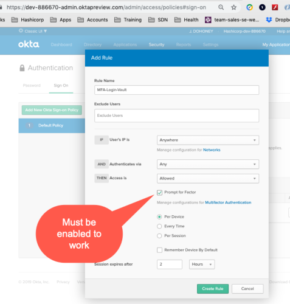

**Vault Multi-factor Authentication**

What is it:

**Multi-factor authentication** (MFA) is an authentication method 
which a computer user is granted access only after successfully
presenting two or more pieces of evidence (or factors) to
an authentication  mechanism. These factors include:

-   Knowledge (something the user and only the user knows -- typically a
    password)

-   Something in the user's possession (something the user and only the
    user has -- Valid Cell Phone Number)

Vault Set-Up

In order to use MFA, an Okta developer account must be obtained from
Okta.com. WARNING, there are two kinds. Going to okta.com

{width="6.012048337707786in"
height="2.2680063429571304in"}

and subscribing will get you a 30-day demo account, and pestering from a
sales person, that will expire. Going to
<https://www.okta.com/developer-sign-up/> will get you an unlimited
access account. The sign up should resemble:

{width="3.8614457567804026in"
height="2.0293219597550305in"}

After you sign up, you will get an email link, that will force you to
change the default password and set-up a challenge question. This is
used if you forget your password. Make sure the domain is
Oktapreview.com

{width="2.376826334208224in"
height="2.204819553805774in"}

a.  Create developer account (this needs to be other than your admin
    account) in Okta

b.  Create \'okta\' group and add developer user account to the group.

c.  Make sure you click "Classic UI" That is not the default, and none
    of the screen shots will make sense from here on in this tutorial.

    {width="4.444444444444445in"
    height="1.8611111111111112in"}

d.  Configure multi-factor authentication with Okta Push mobile app.

    {width="3.7650601487314086in"
    height="2.536991469816273in"}

e.  Next, navigate to Factor Enrollment, Click "Add Rule"

    {width="3.5602405949256344in"
    height="2.563297244094488in"}

f.  Your Choice how you want to configure the rule but update the rule
    to save it.

> {width="3.5028937007874017in"
> height="3.096385608048994in"}

g.  Next, go to Security Authentication, and enable MFA in the Login,
    click "Create Rule" to save

    {width="2.883594706911636in"
    height="3.126505905511811in"}

h.  To set-up a Security Token, go to Security \| API \| Token. Be sure
    to save off the Token string to your 1Password for future reference
    in configuring the demo

{width="3.2229549431321085in"
height="1.8012051618547682in"}

i.  Assuming you have a user set-up, log out of your Admin account, and
    log into your developer account. Go to User \| settings

{width="3.8072287839020125in"
height="1.404608486439195in"}

j.  Find the "Extra Verification" Canvas, and click (1) "Setup", (2)
    Select your device type, (3) and "Next" to bring up the Okta Verify
    on your phone, find the circle with the plus (on Android) and Scan
    the QR code to add your user

    {width="3.8762062554680665in"
    height="4.090360892388452in"}

k.  Set-Up is done in Okta

l.  Before you start Vagrant, copy the vars.yaml.example to vars.yaml.

m.  For the MFA Demo, change by editing vars.yaml

    a.  Username

    b.  Org

    c.  Token

    d.  The base url should stay the same

{width="3.5694444444444446in"
height="0.7222222222222222in"}

n.  Vagrant up

o.  Once the initialization is done, Login into Vault with your
    user/developer you added. Make sure your phone is unlocked to see
    the Push, so you can approve it. It is somewhat anti-climactic, but
    at this point, you should be MFA into Vault.

Okta has several options for MFA, but only Okta Verify works -- I
tried...

{width="3.763888888888889in"
height="4.472222222222222in"}

In order for push notifications to work, they take advantage of
timestamps on your phone. I have reason to set mine to Zulu time, for
navigation reasons. I would assume most people leave "Automatic Date and
Time" toggled on, but check it. If it is not one, turn it on. This is
the Android setting, Mac and Windows phones are different.

{width="2.233475503062117in"
height="3.150602580927384in"}
