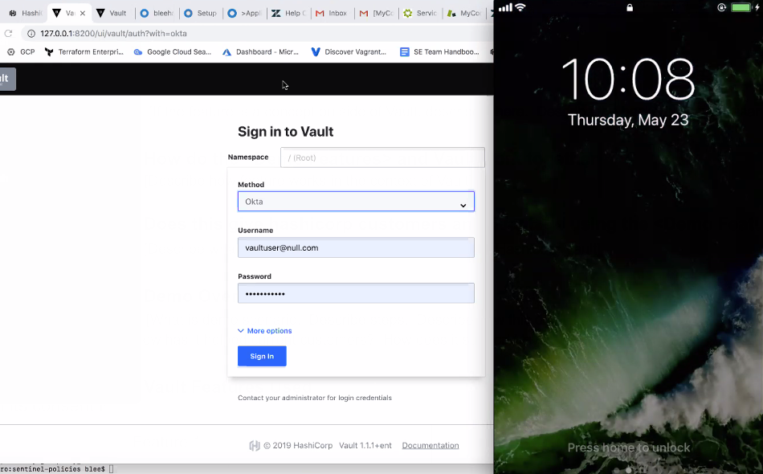
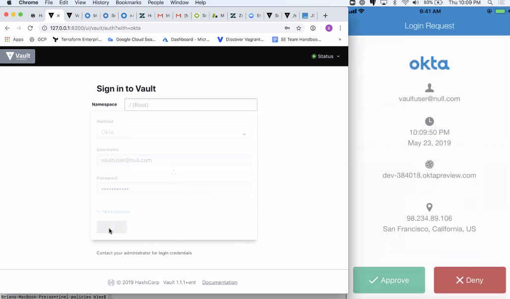
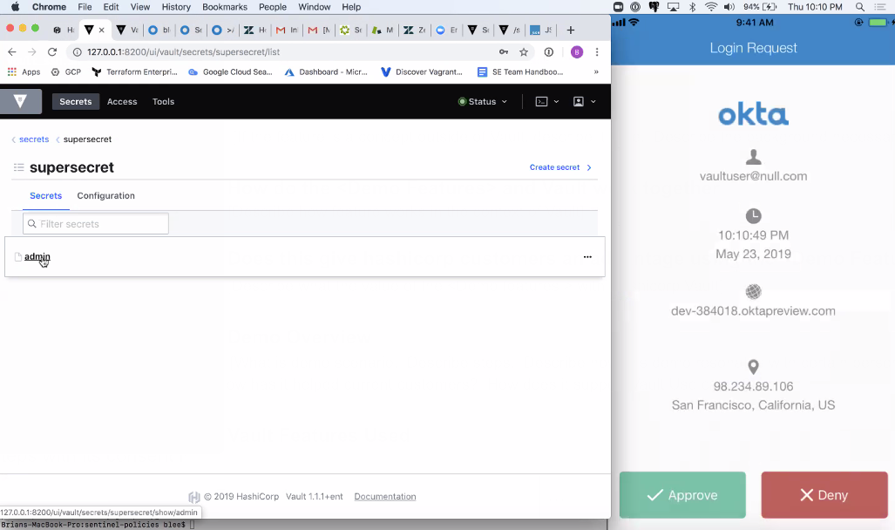
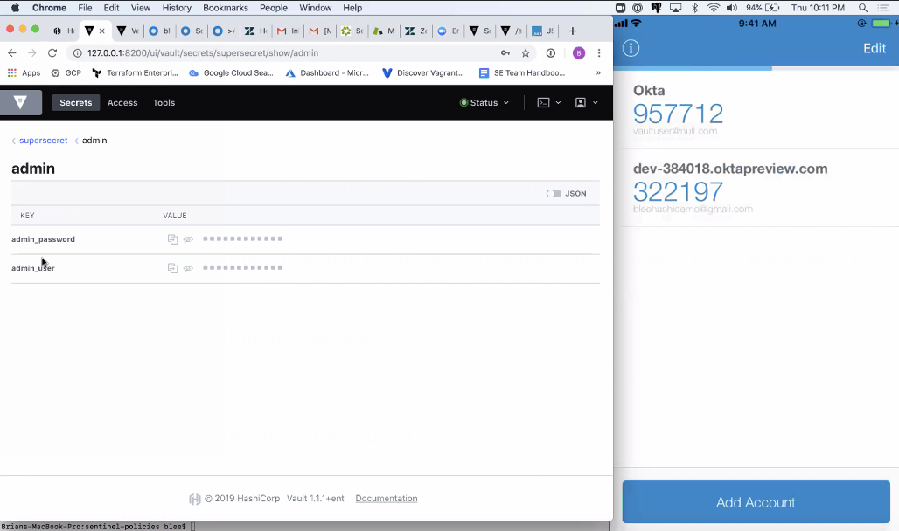

# Summary
This guide demonstrates the following:
- Sentinel enforcement of Okta multi-factor authentication
- SSH certificate authority access management based on Okta MFA
- SSH one-time password access management based on Okta MFA
- AWS secret backend allowing for short-lived AWS credentials

## Prerequisites
1. Vagrant installed
2. VirtualBox installed
3. Okta account configured  
3. Follow the [link for detailed set-up within the Okta Developer Portal for MFA](./OKTA.md)
4. Done with setup

## Demo Presentation

For SE's with a Apple Phone, the Apple Quicktime player can be used to show the Okta Verify - Push notifications.  This adds to the demo experience.

The first part of the demo is to show off Vaults MFA Login capability with Okta



Draw the audience's attention to the push notification, and remind them about the security implications of 2FA/MFA and how this mitigates Brute Force attacks



In our demo example, in order to gain access to this secret, the person accessing the data must MFA.  Also, be sure to stop the demo at some point to show the clients the Sentinel policy. 

```
import "strings"
import "mfa"

okta_valid = rule {
   mfa.methods.okta.valid
}

main = rule {
   okta_valid

}

print(request.path)
```

Note: Liberally take advantage of Sentinel print().  A lot of understanding of what is happening during development can save a lot of time writing a sentinel policy.

The ACL that can also drove the MFA access should also be shown to show the enhanved capability of Vault Enterrpise:

```
path "supersecret/admin" {
 capabilities = ["list", "read"]
 mfa_methods  = ["okta"]
}
```

Demonstrate the MFA for accessing a secret, now that the groundwork has been laid after discussing the Sentinel enforcement and ACL Enterprise enhancements for MFA methods.



Success, MFA in Vault Enterprise enforced MFA to access our demonstration secret.




